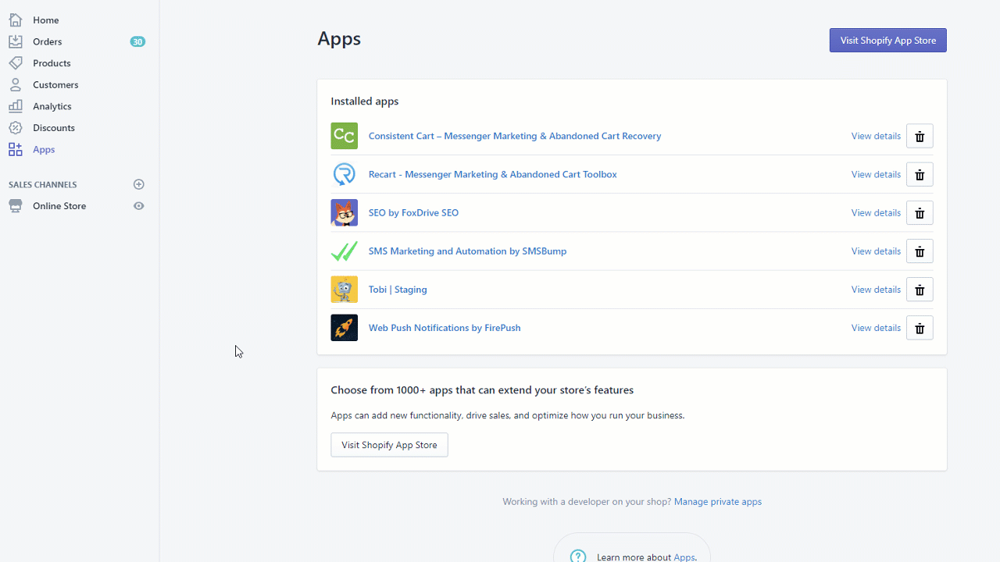

# Why can’t I see the opt-in box on my store?

<figure><figcaption></figcaption></figure>

A shop can only have one Messenger app enabled, otherwise they interfere with each other.

If you can’t see the opt-in box, you might have more than one Messenger app installed, or the Shopify Messenger channel is enabled.

1\. Check for apps and delete any unused ones.

<figure><figcaption></figcaption></figure>

2\. Check if the Shopify channel is enabled. If it is, turn it off.

<figure><figcaption></figcaption></figure>
