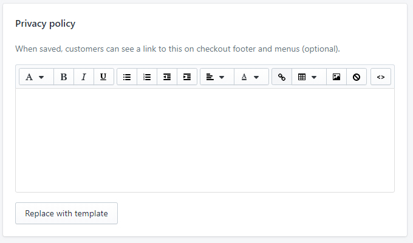

# STEP 5. Legal documentation

Please note: we are not a certified legal advisor so we encourage you to hire or consult your legal advisor who is familiar with TCPA before pasting our legal texts.

Lastly, you should add a link to Tobi's SMS program Terms of service and Privacy policy to your own Terms and Privacy policy. To do so, please visit your Shopify admin panel:

**Settings > Legal** and scroll down to find **Privacy policy** and **Terms of service.**

<figure><figcaption></figcaption></figure>

In the field labeled **Privacy policy,** copy the text below and paste it into the box after your main Privacy Policy text:

**SMS marketing:** By providing my number and/or email, I electronically agree, that Tobi on behalf of \[ BRAND ] may use automated means to send recurring mobile messages/emails. Additional mobile messages/emails may be sent periodically based on your interactions with us. Not more than 5 SMS messages or emails per week. MSG & data rates may apply. Reply STOP to unsubscribe or HELP to help. Alternatively, click the unsubscribe URL provided to unsubscribe.

For more info view our SMS mobile messaging marketing program privacy policy: [https://tobibots.com/sms-privacy-policy/](https://tobibots.com/sms-privacy-policy/)​

In the field labeled **Terms of service,** copy the text below and paste it into the box after your main Terms of Service text:

**SMS marketing:** SMS mobile message marketing program terms and conditions [https://tobibots.com/sms-terms-and-conditions/](https://tobibots.com/sms-terms-and-conditions/)​

If you'd like, you could use our template for your Terms of service, if you don't have it yet. You can find it [here](https://help.tobi.ai/tcpa-compliance/step-5.-legal-documentation/model-agreements-to-help-you-update-your-terms-of-service).
